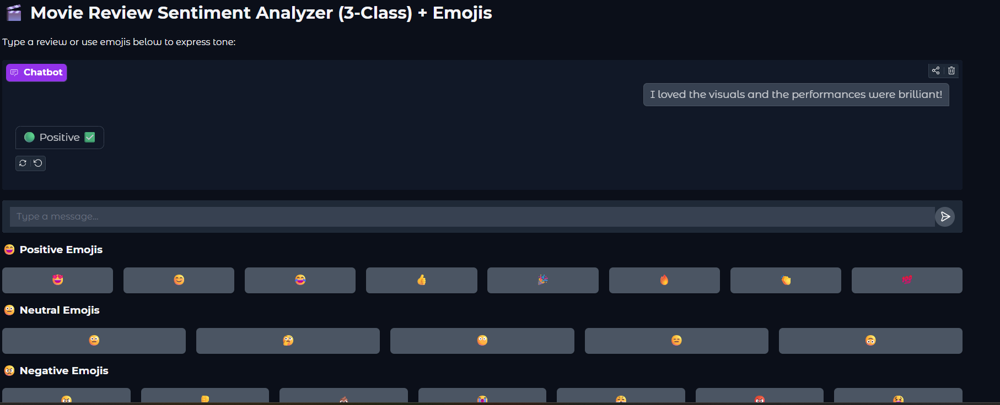

# 🎬 IMDb Movie Review Sentiment Analyzer (3-Class) + Emojis

An interactive chatbot that analyzes movie reviews and classifies them as **Positive**, **Neutral**, or **Negative**, with a modern Gradio interface and emoji-enhanced user experience.

> 🟢 Positive ✅ | ⚪ Neutral 😐 | 🔴 Negative ❌

---

## 🚀 Live Demo

🎯 Try it out on Hugging Face Spaces:  
🔗 [https://huggingface.co/spaces/drashti3001/IMDB_Analyser](https://huggingface.co/spaces/drashti3001/IMDB_Analyser)

---

## 📸 Demo Screenshot



A full web app with emoji buttons and instant 3-class sentiment feedback using classic ML and NLP.

---

## 💡 Features

- ✅ **3-Class Sentiment Classification**: Positive, Neutral, Negative
- 🤖 **Logistic Regression + TF-IDF** model for real-time review analysis
- 🧠 **IMDb movie review dataset** via NLTK
- 💬 **Emoji-enhanced interaction** with clickable sentiment buttons
- 🖥️ **Gradio UI** with clean chat interface
- 🌐 **Hosted on Hugging Face Spaces** (free & public)

---

## 🛠️ Tech Stack

| Tool           | Purpose                        |
|----------------|-------------------------------|
| Python         | Programming Language           |
| scikit-learn   | ML pipeline (TF-IDF + LR)      |
| NLTK           | IMDb dataset for training       |
| Gradio         | Chat interface frontend        |
| Hugging Face   | Live app deployment            |

---

## 📦 Installation

### 🔧 Requirements
- Python 3.7+
- pip

### ▶️ Run Locally

```bash
git clone https://github.com/drashti3001/IMDB_Analyser.git
cd IMDB_Analyser
pip install -r requirements.txt
python app.py
